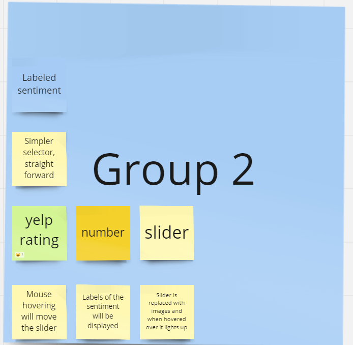
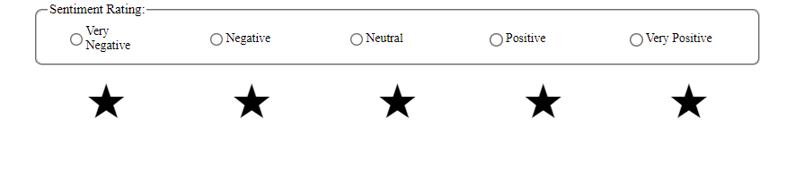
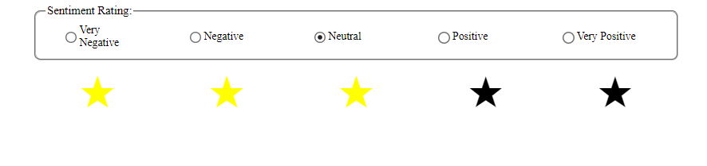
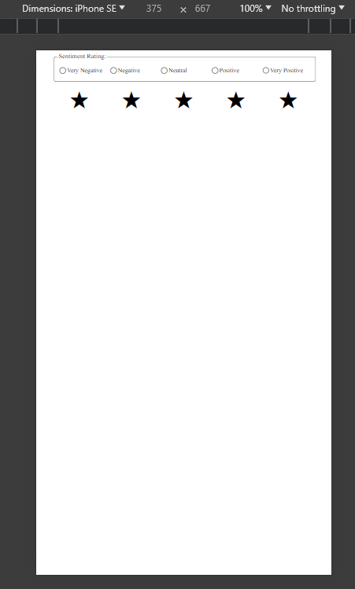
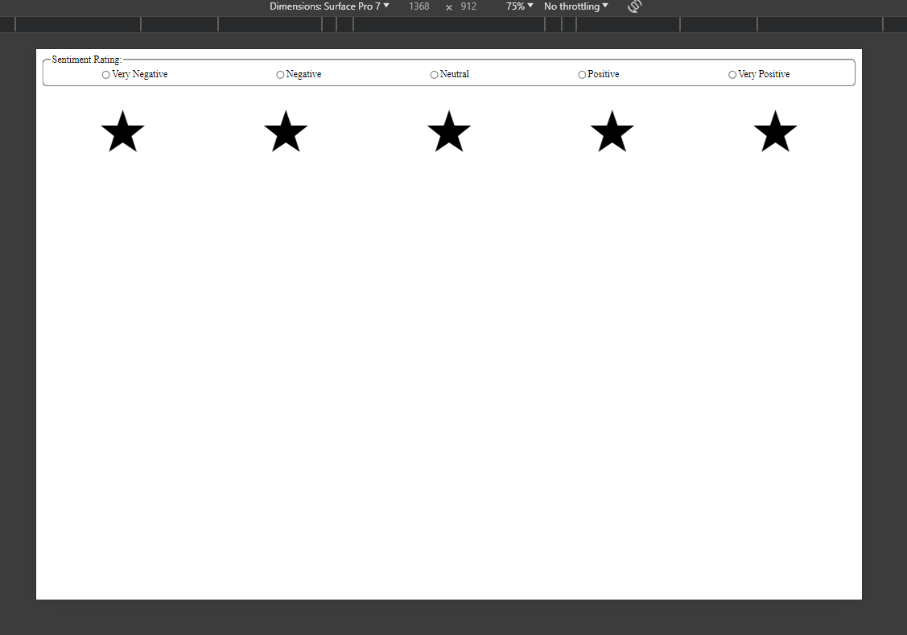

# Sentiment Widget Documentation

## Summary
This is a widget designed to survey users on their feelings. 
They are given 5 options: very negative, negative, neutral, positive, and very positive.
Once a selection is made, the respective amount of stars will light up.

## Early Designs

Here are some ideas that we kept and discarded.
### Kept
* Labeled feedback to user's sentiment selection
* Simple and straight forward interface and experience
* Star rating system, similar to yelp review.
* Keyboard accessibility
* Font adjustments based on screen size.
### Discarded
* Using slider to receive user selection
* Slider that contains different icons representing the value of the slider
* A rating system based on numbers

## Features
### **Simple** and **straight** design:

### **Responds** to user selection:

### **Flexible** font size:
*Small* screen

**Big** screen

