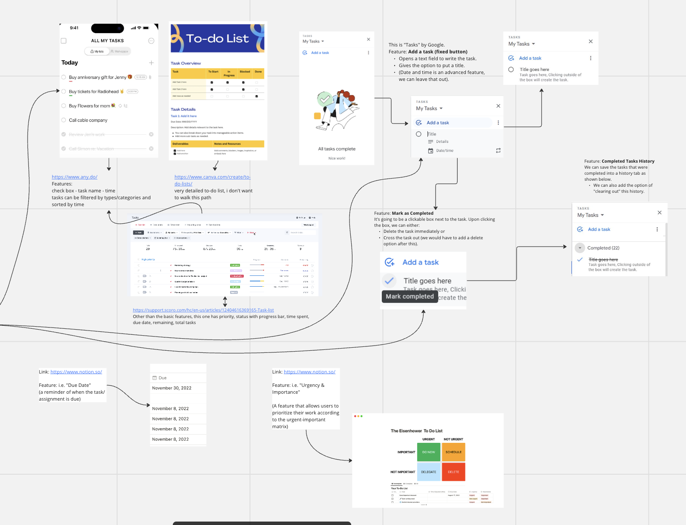
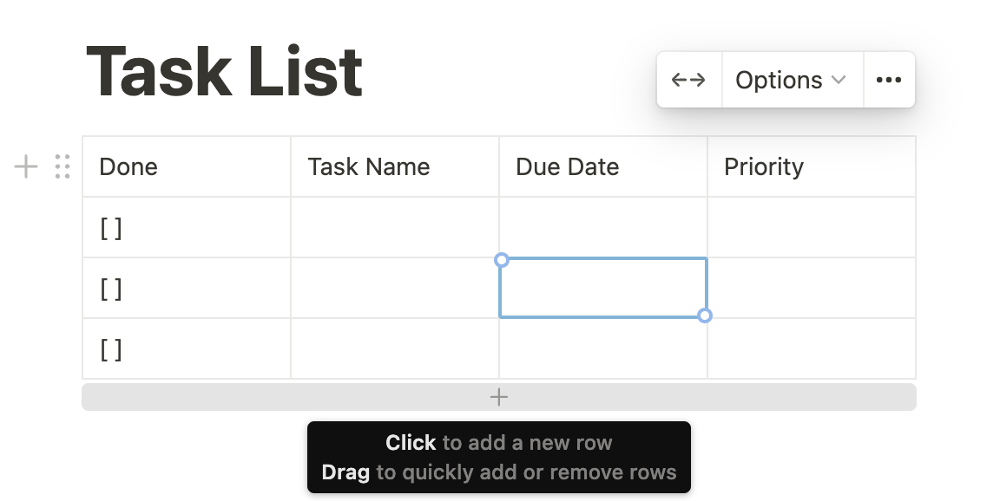
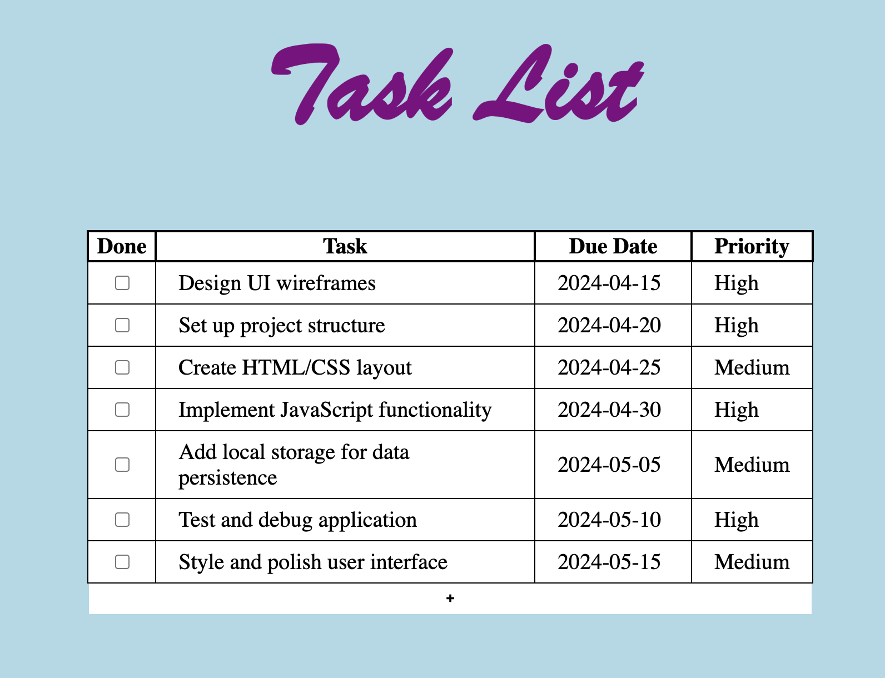
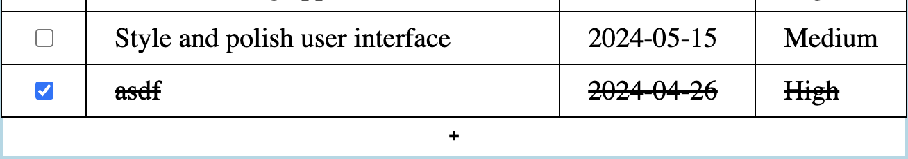

# Task List Documentation

## Summary
Task List designed for optimal and accesible functionality, paired with a color pallete easy to the eyes. Features include task creation, collecting user input on the name of the task, date, as well as its priority. Checkbox allowing for collection of completed tasks.

## Early Designs

Here are some ideas that we kept and discarded.
### Kept
* Each task entry (checkbox, priority, etc.)
* Add task button
* Mark as completed
### Discarded
* Filter
* Detail-oriented features

## Features
### **Simple** and **straight** design:

### **Responds** to user selection:

